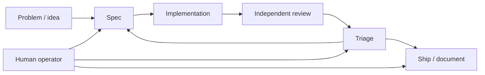

# AI Productivity Stack

**A practical operating model for AI-assisted product development.**

This repo documents how I use AI agents, handoff files, local tools, and human review to move from idea to working software without losing control of the work.

It is part portfolio artifact, part architecture note, and part working blueprint for how a solo operator or small team can organize AI-assisted execution.

---

## What this is

The AI Productivity Stack is a structured workflow for turning scattered tasks, product ideas, and technical problems into a repeatable build pipeline:

```text
Frame the problem → write the spec → implement → review → triage → ship
```

The point is not to let AI randomly build things. The point is to give each tool a lane, keep the human in charge, and make the work inspectable.

---

## Why it matters

AI tools are powerful, but most workflows become messy fast: chat history everywhere, half-finished outputs, unclear decisions, and no clean handoff between planning, coding, review, and shipping.

This stack solves that by treating AI like an operations system:

- clear roles for each tool or agent
- written handoffs instead of vague chat instructions
- independent review before accepting changes
- local-first thinking for sensitive work
- documentation that explains why decisions were made

---

## Core workflow

| Stage | Purpose | Example output |
|---|---|---|
| Problem framing | Define what actually needs to be solved | Brief, user story, acceptance criteria |
| Architecture | Decide how the system should work | Diagrams, API notes, data flow |
| Implementation | Build the feature or tool | Code, config, scripts, UI updates |
| Review | Check quality, security, and maintainability | QA notes, bug list, refactor suggestions |
| Triage | Decide what gets fixed now vs. later | Priority list, issue notes, next actions |
| Shipping | Package the result so others can understand it | README updates, changelog, release notes |

---

## Product areas connected to this stack

| Area | Description |
|---|---|
| **module_09** | Desktop command-center concept for task routing, local AI support, and daily execution |
| **Chaos Monk** | Small developer/operator tools built for clarity and local-first workflows |
| **Kairos** | Private iOS mental-health companion project with strong privacy and safety considerations |
| **Ground Truth** | Context and verification engine for structured geopolitical research |
| **Error Radar** | VS Code extension that surfaces workspace diagnostics in one place |

Some related projects are private while they mature. The public goal here is to show the operating model, not expose unfinished product internals.

---

## Example agent lanes

| Lane | Role | Human control point |
|---|---|---|
| Product / planning | Converts messy goals into specs and priorities | Approve scope before coding |
| Implementation | Writes or refactors code against the spec | Review diff before merge |
| QA / review | Looks for bugs, security issues, and maintainability problems | Decide what to fix now |
| Research | Gathers context, compares options, and explains tradeoffs | Validate sources and assumptions |
| Operations | Handles local files, setup steps, and repeatable tasks | Approve destructive actions |

---

## Architecture sketch


```mermaid
flowchart LR
    A[Problem / idea] --> B[Spec]
    B --> C[Implementation]
    C --> D[Independent review]
    D --> E[Triage]
    E --> F[Ship / document]
    E --> B

    H[Human operator] --> B
    H --> E
    H --> F
```

---

## Tools and technologies

This workflow has been used across projects involving:

- Python and FastAPI
- TypeScript and React
- Swift and SwiftUI
- Rust and Tauri
- SQLite / PostgreSQL concepts
- Ollama and local LLM workflows
- Claude, OpenAI, Gemini, and other AI coding/research tools
- GitHub-based version control and documentation

---

## What this demonstrates

This repo is meant to show that I can:

- break down ambiguous problems into buildable work
- design AI-assisted workflows without giving up human judgment
- document architecture and handoffs clearly
- think like both an operator and a product builder
- use AI tools in a disciplined, inspectable way

---

## Status

This is an evolving portfolio and architecture repo. It is not a packaged SaaS product by itself. The value is in the operating model and the product ecosystem it supports.

Planned improvements:

- add example handoff templates
- add sample QA review format
- add screenshots from related tools where appropriate
- add a simple demo workflow from idea to shipped issue

---

## About

Built by **Lawrence Magee**, a U.S. Army IT veteran and AI systems builder focused on practical automation, local-first workflows, and product execution.

- GitHub: [@lmagee3](https://github.com/lmagee3)
- Profile / portfolio: [lmagee3](https://github.com/lmagee3)
- Chaos Monk: [chaosmonk.netlify.app](https://chaosmonk.netlify.app)
