# AI Productivity Stack — Multi-Agent Architecture


## Value Proposition

**module_09 is an AI Operations Cockpit for founders and lean teams** — a local-first system that turns messy idea flow into a repeatable shipping pipeline: **Spec → Implement → Review → Triage → Ship**.

### Who this is for
- Solo founders building products with AI support
- Small teams needing faster execution with tighter QA
- Operators who want documented handoffs, not chat-only workflows

### Business outcomes
- Faster cycle time from concept to shipped output
- Fewer dropped tasks through explicit handoff lanes
- Better decision quality with human-in-the-loop control

### Work with MAGE Software
If you want this operating model implemented in your stack, reach out via GitHub or connect with **Lawrence Magee**.

---

## Overview

This is a **production multi-agent AI system** designed for solo operators and distributed teams. Built by **Lawrence Magee** — a 20-year US Army IT veteran — this architecture demonstrates how to orchestrate specialized AI agents across strategy, execution, QA, and research lanes while maintaining human-in-the-loop oversight and deterministic shipping.

The system powers:
- **module_09** — AI-native desktop command center (Tauri/Rust, React, FastAPI, local LLM)
- **Kairos** — iOS mental health app with voice-first therapy matching (Swift, Claude API, ElevenLabs)
- **Chaos Monk** — Developer tools and MCP connectors (revenue engine)
- **MAGE Software** — Autonomous AI business operations platform

**Key innovation**: Real-time agent coordination through spec → implement → review → triage → ship handoff pipeline, with Notion as the source-of-truth for task triage and agent assignments.

---

## Architecture

### System Diagram

```mermaid
flowchart TB
    subgraph Command["🎯 Command Layer"]
        Lawrence["Lawrence Magee<br/>(Human-in-the-Loop)"]
        Opus["Claude Cowork — Opus<br/>(COO / Product Owner)"]
        Lawrence -->|Approves| Opus
        Opus -->|Strategic Direction| Lawrence
    end

    subgraph Execution["⚙️ Execution Layer"]
        Sonnet["Sonnet / Claude Code<br/>(Product Implementation)"]
        Codex["Codex / OpenAI<br/>(Infrastructure)"]
        OpenClaw["OpenClaw<br/>(Local Operations)"]
        Opus -->|Product Specs| Sonnet
        Opus -->|Backend Specs| Codex
        Opus -->|File/Ops Tasks| OpenClaw
    end

    subgraph Quality["✅ Quality Layer"]
        Antigravity["Antigravity / Google<br/>(QA & Code Review)"]
        Sonnet -->|All Commits| Antigravity
        Codex -->|All Commits| Antigravity
        Antigravity -->|Review Findings| Opus
    end

    subgraph Research["🔬 Research Layer"]
        ChatGPT["ChatGPT / Atlas<br/>(Research & Data)"]
        Gemini["Gemini<br/>(Market Analysis)"]
        Copilot["Copilot / GitHub<br/>(IDE Assistant)"]
        Opus -->|Research Tasks| ChatGPT
        Opus -->|Competitive Analysis| Gemini
        Eve["Eve<br/>(PM Workflow)"]
    end

    subgraph Products["📦 Products"]
        Module09["module_09<br/>(Tauri Desktop App)"]
        Kairos["Kairos<br/>(iOS Mental Health)"]
        ChaosMon["Chaos Monk<br/>(Developer Tools)"]
        Device01["device_01<br/>(Local AI Hardware)"]
        Module09 -->|Driven By| Opus
        Kairos -->|Driven By| Opus
        ChaosMon -->|Driven By| Opus
        Device01 -->|Driven By| Opus
    end

    subgraph Data["💾 Data Infrastructure"]
        LocalDB["Local DB<br/>(SQLite/PostgreSQL)"]
        Notion["Notion<br/>(Command Post)"]
        Ollama["Ollama<br/>(Local LLM)"]
        ElevenLabs["ElevenLabs<br/>(Voice API)"]
        ClaudeAPI["Claude API<br/>(Remote LLM)"]
        LocalDB <-->|Bi-directional| Notion
        Module09 <-->|Query/Sync| LocalDB
        Kairos -->|API Calls| ClaudeAPI
        Kairos -->|Voice Synthesis| ElevenLabs
        Module09 -->|Local Inference| Ollama
    end

    subgraph Module09Arch["module_09 Internal Architecture"]
        TauriShell["Tauri Shell<br/>(Rust Runtime)"]
        ReactFE["React Frontend<br/>(TypeScript)"]
        FastAPIBE["FastAPI Backend<br/>(Python)"]
        TauriShell -->|IPC| ReactFE
        TauriShell -->|Invoke| FastAPIBE
        ReactFE -->|HTTP| FastAPIBE
        FastAPIBE -->|Local Query| LocalDB
        FastAPIBE -->|Sync| Notion
        FastAPIBE -->|Inference| Ollama
    end

    subgraph KairosArch["Kairos Internal Architecture"]
        Swift["Swift/SwiftUI<br/>(iOS Frontend)"]
        SwiftBackend["Kairos Backend<br/>(Logic Layer)"]
        Swift -->|State| SwiftBackend
        SwiftBackend -->|API Calls| ClaudeAPI
        SwiftBackend -->|Voice| ElevenLabs
    end

    subgraph Comms["📡 Communication & Handoffs"]
        ClaudeMD["CLAUDE.md<br/>(Context DB)"]
        Handoffs["Handoff Docs<br/>(specs, briefs)"]
        CommandPost["Notion Command Post<br/>(Daily Briefs & Orders)"]
        Opus -->|Updates| ClaudeMD
        Opus -->|Writes| CommandPost
        Sonnet -->|Reads| CommandPost
        Codex -->|Reads| CommandPost
        Sonnet -->|Writes| Handoffs
        Codex -->|Writes| Handoffs
        Antigravity -->|Reads| Handoffs
    end

    Opus -->|Coordinates| Execution
    Opus -->|Monitors| Quality
    Opus -->|Directs| Research
    Execution -->|Outputs| Products
    Research -->|Informs| Opus
```



---

## 🤖 Agent Roster

| Agent | Role | Tech Stack | Lane |
|-------|------|-----------|------|
| **Claude Cowork — Opus** | COO / Product Owner | Claude API (Opus) | Strategy, architecture, product vision, sprint planning, all go/no-go decisions |
| **Sonnet / Claude Code** | Product Implementation | Claude API (Sonnet) | Frontend code, UI/UX, feature implementation, component work |
| **Codex / OpenAI** | Infrastructure & Backend | GPT-4, Copilot API | Backend routes, APIs, DevOps, database models, scheduler jobs |
| **Antigravity / Google** | QA & Code Review | Gemini (Google IDE) | Independent commit review, bug detection, security scanning (review-only) |
| **OpenClaw** | Local Operations Manager | File system, bash, Python | Local file operations, environment setup, coordination |
| **ChatGPT / Atlas** | Research & Data Ingestion | GPT-4, web APIs | Web crawling, Notion population, MBA task extraction, research docs |
| **Gemini** | Market Research & Analysis | Google Gemini | Competitive analysis, market sizing, industry research |
| **Copilot / GitHub** | IDE Assistant | GitHub Copilot | Xcode integration, in-editor code suggestions, refactoring hints |
| **Eve** | AI PM & Workflow Tracking | Custom UI | Task tracking, cycle planning, priority management |

---

## 📦 Product Lineup

### module_09
**AI-native personal command center for solo operators.** Desktop app built with Tauri (Rust shell), React frontend, FastAPI backend, local Ollama LLM.
- Mission control dashboard with unified task inbox
- Real-time Notion sync with bidirectional updates
- Local-first architecture — all sensitive data stays on-machine
- Dual-model routing: fast lane (Ollama) + deep lane (Claude API)
- Built in Feb 2026, ready for SaaS scaling

### Kairos
**iOS mental health app.** Pre-therapy AI assistant + therapist matching for professionals 25–35.
- Voice-first interface (mic + Claude Haiku + ElevenLabs TTS)
- Clinical-grade therapy matching engine
- HIPAA-ready (path to SaMD FDA certification post-funding)
- Target exit: $3–10M or full Software-as-Medical-Device path
- Current: MVP (v2), Future: v3 with local DSM-trained model

### Chaos Monk
**Developer tools, MCP connectors, plugins.** Revenue engine under Malleus Prendere.
- Standalone tools and integrations
- Community-driven extensibility
- Monetized through Gumroad + enterprise licensing

### device_01
**Local AI server hardware.** Concept stage. Bundled Ollama + NVIDIA GPU + local module_09 backend for distributed teams.

---

## 🏗️ Tech Stack Summary

### Backend & Infrastructure
- **FastAPI** — RESTful API, async task scheduling, Notion sync
- **SQLAlchemy** — ORM for SQLite/PostgreSQL
- **Ollama** — Local LLM inference (Gemma/Mistral)
- **Claude API** — Remote reasoning, therapist matching, voice understanding
- **ElevenLabs API** — Natural voice synthesis for Kairos

### Frontend & Desktop
- **Tauri** (Rust) — Secure desktop shell for module_09
- **React + TypeScript** — Modern UI for desktop and web dashboards
- **SwiftUI** — Native iOS interface for Kairos
- **Mermaid** — Architecture documentation

### Data & Sync
- **SQLite / PostgreSQL** — Local source of truth
- **Notion API** — External sync, task triage, agent command post
- **JSON/YAML** — Handoff specs and configuration

### DevOps & CI/CD
- **GitHub** — Source control, Actions (planned)
- **Docker** (planned) — Containerized backend services

---

## 📊 Data Flow

### Command Post Pipeline (Task → Ship)
1. **Lawrence checks Notion Command Post** → reads daily brief from Claude Cowork
2. **Notion Database sync** → task triage, priority assignment
3. **Claude Cowork → CLAUDE.md** → updates architecture/context
4. **Opus → Handoff Spec** → detailed implementation brief to Sonnet/Codex
5. **Sonnet/Codex implements** → writes code, pushes branches
6. **Antigravity reviews** → independent QA, security checks
7. **Opus triages findings** → approves or assigns rework
8. **Ship to production** → module_09 desktop auto-update or Kairos App Store

### Data Sovereignty Flow
```
Local SQLite ←→ Python Backend ←→ Notion API
     ↓                 ↓               ↓
  User Data      Task Processing    Team Sync
```
- **Source of truth**: Local SQLite (no cloud lock-in)
- **Sync target**: Notion (collaborative access)
- **Inference**: Local (Ollama) or remote (Claude API) depending on sensitivity

---

## 🎯 Autonomous Company Architecture (MAGE Software)

Each business function is an **AI agent or agent chain** operating under defined authority:

| Department | AI Function | Autonomy Level |
|-----------|-------------|-----------------|
| **Executive / Strategy** | Claude Cowork — planning, prioritization, roadmap | Full (with Lawrence oversight) |
| **Product Development** | Sonnet + Codex — feature implementation | High (Opus approves specs) |
| **Quality Assurance** | Antigravity — independent review | Full (report-only, no commits) |
| **Operations & Pipeline** | Notion sync, daily briefs, task triage | Full (automated) |
| **Research & Data** | ChatGPT/Atlas + Gemini | High (Opus directs tasks) |
| **Sales & Revenue** | Planned — Kickstarter, partnership outreach | Medium (Lawrence approves) |
| **Marketing & Content** | Planned — AI-generated SEO, social media | High (Opus directs strategy) |
| **Legal & Compliance** | Planned — FDA SaMD research, IP protection | Medium (Lawrence approves) |
| **Finance & Accounting** | Planned — budget tracking, investor reporting | Medium (Lawrence final say) |

**Human Oversight**: Lawrence is the sole approval committee for spending, legal commitments, account creation, and API keys. All other operations run autonomously within guardrails.

---

## 🚀 Getting Started

### Prerequisites
- Python 3.11+
- Node.js 18+ (for React)
- Rust toolchain (for Tauri)
- Notion account + internal integration token
- Claude API key (Anthropic)
- ElevenLabs API key (optional for voice)

### Local Development

```bash
# Clone the repo
git clone https://github.com/gl0balist/ai-productivity-stack
cd ai-productivity-stack

# Install backend dependencies
cd backend
pip install -r requirements.txt
export NOTION_TOKEN=<your-notion-token>
export CLAUDE_API_KEY=<your-api-key>
python -m uvicorn main:app --reload

# Install frontend (in another terminal)
cd ../module_09
npm install
npm run dev

# Run Ollama (local inference)
ollama pull gemma:7b
ollama serve
```

---

## 📚 Documentation

- **[Agent Roles](./docs/agent-roles.md)** — Detailed breakdown of each AI agent
- **[Data Flow](./docs/data-flow.md)** — Complete task and data pipelines
- **[Autonomous Company Architecture](./docs/autonomous-company-architecture.md)** — MAGE Software scaling plan
- **[Architecture Diagram](./architecture.mermaid)** — Full system flowchart

---

## 💼 Key Metrics & Vision

**Current State (Feb 2026)**:
- Multi-agent system fully operational
- module_09 MVP built and ready for user testing
- Kairos v2 in beta, pre-therapy AI assistant live
- $2K MVP budget, ~$400/mo passive runway

**Target Exit**: $3–10M acquisition (Kairos) OR SaMD FDA certification path for premium healthcare B2B

**Revenue Engines**:
1. Kairos licensing (therapist marketplace)
2. MAGE Software / module_09 SaaS
3. Chaos Monk developer tools

---

## 👤 Author

**Lawrence Magee**
20-year US Army IT veteran | MBA Candidate (Bellevue University, graduating Nov 2026) | Based in Batangas, Philippines

- 📧 Email: [gl0balist.78@gmail.com](mailto:gl0balist.78@gmail.com)
- 🔗 LinkedIn: [lawrence-magee](https://www.linkedin.com/in/lawrence-magee/)
- 🐙 GitHub: [@gl0balist](https://github.com/gl0balist)

---

## 📄 License

This architecture is proprietary to **Malleus Prendere** (holding company) and **MAGE Software**. All agent role definitions, handoff protocols, and autonomous company operations are confidential IP.

Public Chaos Monk tools and Kairos IP available under separate commercial license.

---

## 🎓 Why This Matters

This isn't just a multi-agent AI system—it's a **scalable blueprint for AI-driven companies**. The key innovations:

1. **Real-time agent coordination** without a centralized orchestration framework (uses Notion + handoff specs)
2. **Deterministic shipping** through spec → implement → review → triage → ship pipeline
3. **Local-first data sovereignty** (SQLite as source of truth, Notion as sync target)
4. **Clear agent boundaries** (each AI knows its lane, escalates up the chain)
5. **Human oversight without bottlenecks** (Lawrence approves decisions, not execution)

Perfect for solo operators scaling to small teams, distributed contractors, and product-focused founders who want AI doing the heavy lifting without losing control.

---

**Built with ❤️ by the MAGE Software team.**
